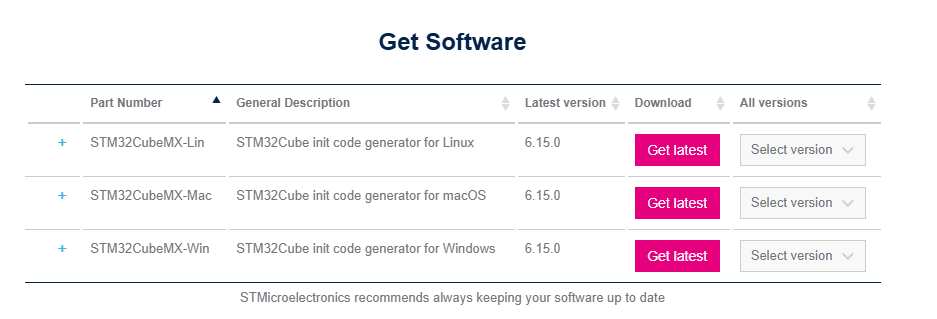

# CubeMX setup tutorial
A tutorial for new members to setup CubeMX, to be used for UW-Madison RoboMaster club.

## Table of Contents
- [For Windows](#windows)
- [For MacOS](#macos)
- [For Linux](#linux)

## Windows
Follow this link to download site: [CubeMX Install](https://www.st.com/en/development-tools/stm32cubemx.html?dl=zQHHwh0hKEI6LNPB071aMg%3D%3D%2CujcTBJ%2Fmjpj3URY%2BCjpxVmbPXDaWux6Rd5r4tXpLHggM3x%2Bc5C6jQWbmKRV1HA9bCQgW9Jj%2Bn%2FzVEo%2FADllhRnip3Wuvxy292FJfO%2Fo6RrP3Eh%2BcaQu%2FHsW2E7G264a5%2FeR%2BCuu6IB7i3QtQgac5VcCkEXflONP0AE1QQg688rHioJGHSWt2293y%2B0CyaFxWrHL1xsaIblQe7yrWvaKK6ylHlPvMdDFZE1vBQxGo8jk%3D&token=7c21226f545e472da0df6ccac4512e3c)

Scroll down to the install section, download the latest version for your system.

Choose download as guest, and enter the information they ask. Successfully doing so will send a download link to the email you provided.

Unzip the downloaded compressed folder, then open the .exe file in that folder. Follow its instructions promptly to download CubeMX, check "create desktop shortcut" for ease use in the future.

## MacOS
Similar to Windows.

## Linux
You should know your stuff already.