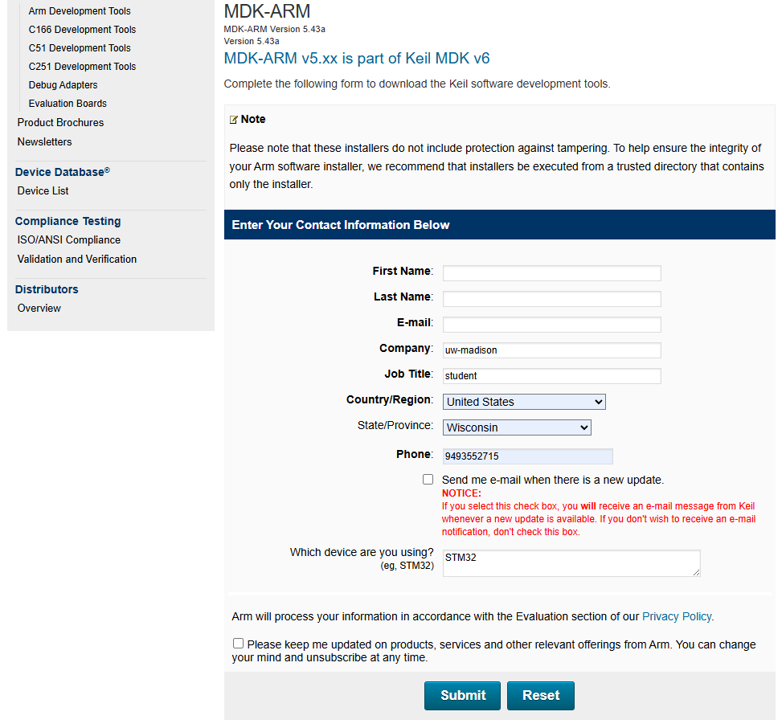
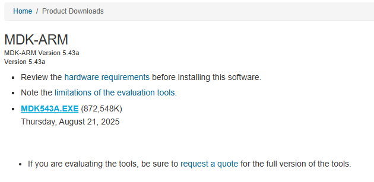
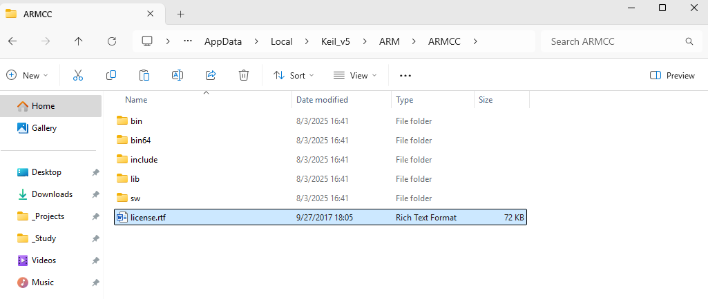
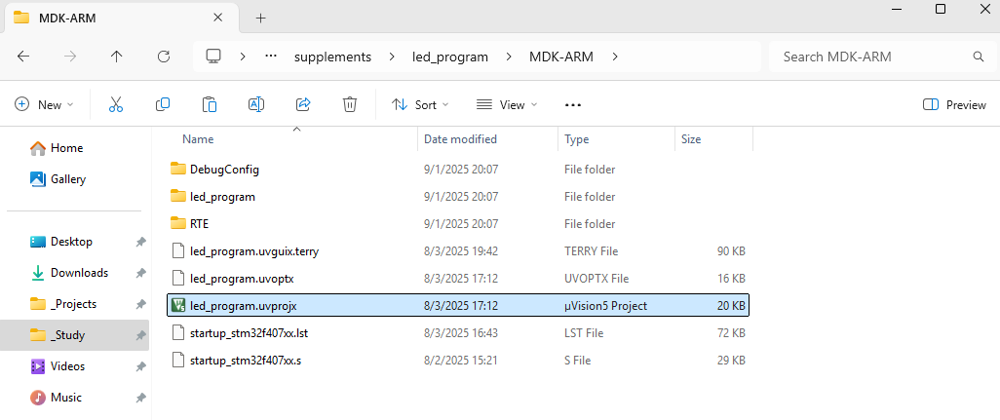
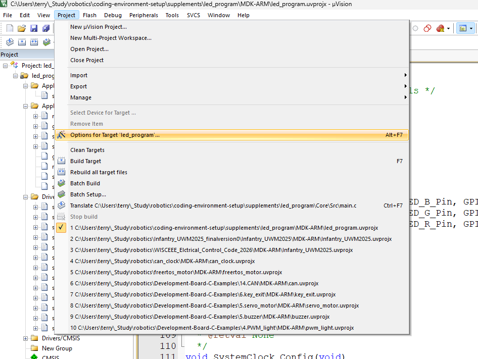
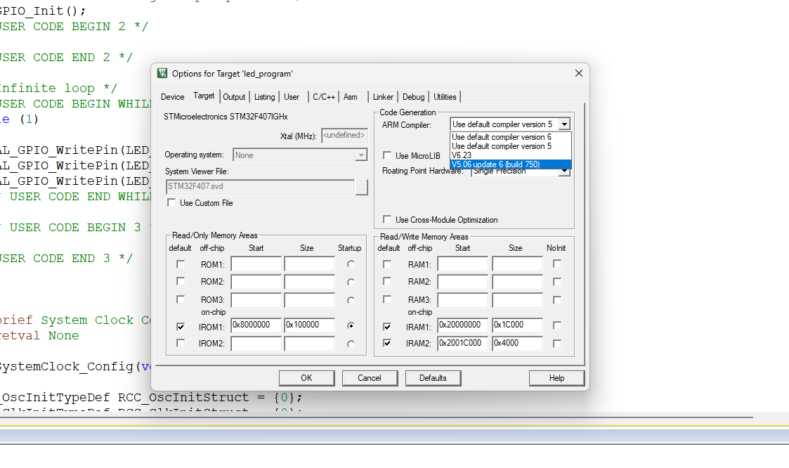
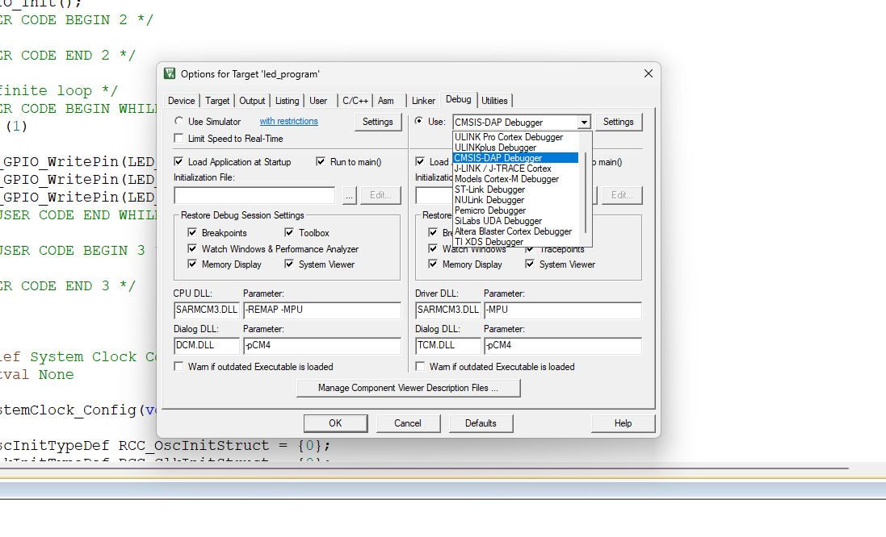
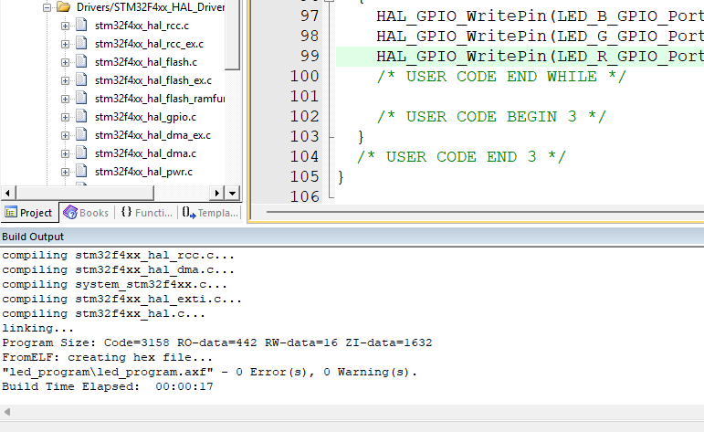

# Keil Setup Tutorial
A tutorial for new members to setup CubeMX, to be used for UW-Madison RoboMaster club.

## Table of Contents
- [For Windows](#windows)
 - [Download Keil](#download-keil)
 - [Download Compiler](#download-compiler)
 - [Open a Keil Project](#open-a-keil-project)
 - [Build a Keil Project](#build-a-keil-project)
 - [Get a Professional License for Keil](#get-keil-professional-license)
- [For MacOS](#macos)
- [For Linux](#linux)

## Windows
### Download Keil
Follow this link to the Keil download page: [Keil](https://www.keil.com/download/product/?utm_source=chatgpt.com)

Click MDK-Arm. Enter your information on the form provided. For "Which device are you using?", enter "STM32".

After completing the form, you will be directed to a page to download the Keil installation executable.

Follow the instructions in the executable to download Keil.
### Download Compiler
Keil is installed with Arm Compiler v6, however, many projects, including ours, requires v5. Follow this link to download the compiler: [Arm Compiler v5](https://developer.arm.com/downloads/view/ACOMP5).

Once logged in, download the following executable: "Arm Compiler 5.06 update 7 (build 960) Win32".

Unzip the downloaded folder, click into and run the setup.exe. The executable will download a folder into your chosen directory. Find your "Keil-v5" directory (which is the Keil you just downloaded in the last section), and create a folder called "ARMCC" (if the folder already exist, overwrite it), and copy everything in the folder you just downloaded into this folder.

### Open a Keil Project
Download the "led_program" under the supplements folder in this repo. Navigate to led_program/MDK-ARM and open "led_program.uvprojx" with Keil. This is how you open any Keil project.

### Build a Keil Project
Once inside the Keil project, navigate to Project -> Options for Target 'led_program'...

In the "Target" page, select the Compiler v5 you just downloaded. In the "Debug" page, select "CMSIS-MAP Debugger".

Click the "Build" button at top right of the IDE. If project builds without any error or warning, you are all set.

Example of successful build:

### Get Keil Professional License
tbd

## MacOS
tbd

## Linux
You should know your stuff already.