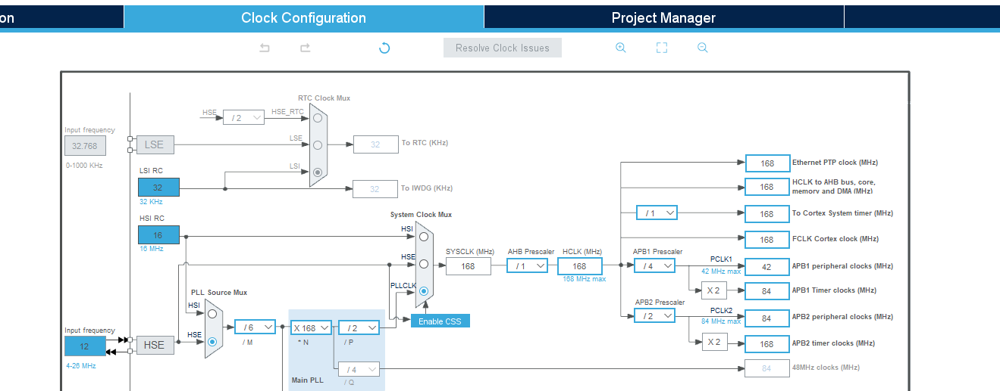
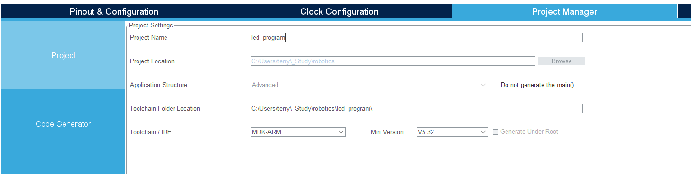

# led_program
Read as your intro to working with STM32CubeMX and Keil.

## Table of Contents
- [Prerequisites](#prerequisites)
- [Creating a New Project in CubeMX](#creating-a-new-project-in-cubemx)
- [Writing the LED Control Code](#writing-the-led-control-code)
- [Helpful Knowledge](#helpful-knowledge)

## Prerequisites
- [CubeMX Setup](../../cubemx-tutorial.md)
- [Keil Setup](../../keil-tutorial.md)
- Optional: [GitHub Practices](../../github-workflow.md)

## Creating a New Project in CubeMX

Open STM32CubeMX -> click File -> New Project. Search for STM32F407IG and select the STM32F407IGHx chip. Click new project button on the top right.

Go to System Core -> RCC and set High Speed Clock (HSE) to Crystal/Ceramic Resonator.

Set up GPIO Pins for led light.
On the Pinout View, find PH10, PH11, PH12, right click on each to open "GPIO_Output". Go to System Core -> GPIO -> Configuration -> GPIO, click on each pin to configurate:
```
GPIO output level: Low
GPIO mode: Output Push Pull
GPIO Pull-up/Pull-down: No pull-up and no pull-down
Maximum output speed: Low
User Label: LED_B (PH10), LED_G (PH11), LED_R (PH12)
```
!(GPIO layout)[images/GPIO-layout.png]

Open Clock Configuration. Set the following:
```
Input Frequence: 12MHz
PLL Source Mux: HSE
M: 6
N: 168
P: 2
System Clock Mux: PLLCLK
SYSCLK (MHz): 168
AHB Prescaler: 1
HCLK (MHz): 168
APB1 Prescaler: 4
APB2 Prescaler: 2
```
Match the following image:


Go to Pinout & Configuration -> SYS, set Debug to Serial Wire.

In Project Manager, name your project and choose Toolchain/IDE = MDK-ARM and Min Version = V5 or V5.XX.


In Code Generator, check:
 - Copy only the necessary library files
 - Generate peripheral initialization as a pair of .c/.h files per peripheral

Click GENERATE CODE button on top right.

Open the generated Keil project.

Setup up the Keil project as shown in [keil-tutorial](keil-tutorial.md).

## Writing the LED Control Code

Use the HAL GPIO function:
HAL_GPIO_WritePin(GPIO_TypeDef* GPIOx, uint16_t GPIO_Pin, GPIO_PinState PinState);

@param GPIOx - port (e.g., GPIOH)
@param GPIO_Pin - pin number (e.g., GPIO_PIN_10)
@param PinState - current set to the GPIO Pin, GPIO_PIN_SET (high/1) or GPIO_PIN_RESET (low/0)

Example (turn all LEDs ON):
main.c
```C
// Inside main loop
while (1) {
	HAL_GPIO_WritePin(LED_R_GPIO_Port, LED_R_Pin, GPIO_PIN_SET);
	HAL_GPIO_WritePin(LED_G_GPIO_Port, LED_G_Pin, GPIO_PIN_SET);
	HAL_GPIO_WritePin(LED_B_GPIO_Port, LED_B_Pin, GPIO_PIN_SET);
}
```


This outputs high level to all three LED pins → Red + Green + Blue light mix into white.

## Helpful Knowledge
Look through `main.c`, trace how the embedded project is intialized each time to the timeline below. Use "F12" to trace definitions of functions you are interested in.

Initialize timeline:
 1. Program starts
 2. HAL_Init
  - Initialize the HAL library, for example, GPIO led pins uses this library.
 3. SystemClock_Config
  - Remember you setup system clock in STM32CubeMX
 4. MY_gpio_Init
  - Initialize the GPIO pins you setup in STM32CubeMX
 5. While (1)