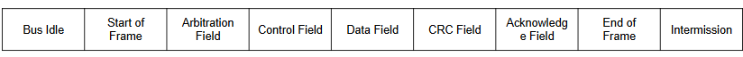
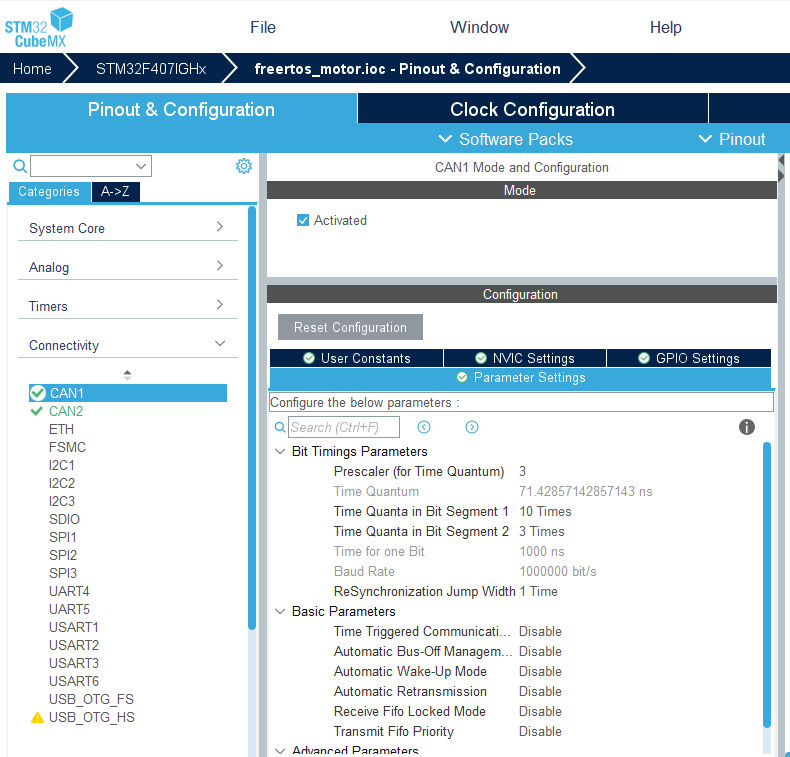
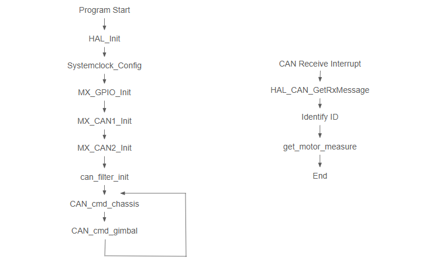

# Controller Area Network (CAN)
Demonstrate using CAN to fetch from and control RobeMaster motor.

## Table of Contents


## What is CAN
Developed by vehicle company BOACH, CAN is now one of the most widely used serial network technology in embedded systems, especially vehicles. CAN is achieved with a real time signal protocol, which is what this tutorial will focus on.

This tutorial is not a comprehensive introduction on CAN, but is dedicated to our RoboMaster development.

## CAN Protocol Format
A full data frame sent with CAN is made up by many components.



However, we mostly care about the Arbitration Field and Data Field.

Arbitration Field contains ID of each device it is communicating. The standard length is 11 bits, but can be extended to 29 bits when there are many devices (think of IPv4 and IPv6 for WiFi, same idea).

After receiving the signal and comfirming that the ID in Arbitration Field matches a device we care about, the Data Field is then analyzed.

Data Field is composed of 2 parts. The DLC is a 4 bits part that specifies how many bits our data has, up to 8 bytes. Then the real data is stored in the next 8 bytes to come.

## CAN for RM Motor
You can search up the manual for a motor in the RM series. We are talking about RM3508 motor here.

The default ID for RM3508 is 0x200. For sending data to control motors, Data segment format looks like this:
```
data[0] - control current high 8 bits for ID=1
data[1] - control current low 8 bits for ID=1
data[2] - control current high 8 bits for ID=2
data[3] - control current low 8 bits for ID=2
data[4] - control current high 8 bits for ID=3
data[5] - control current low 8 bits for ID=3
data[6] - control current high 8 bits for ID=4
data[7] - control current low 8 bits for ID=4
```

For receiving data about a specific motor, ID is 0x200 + Motor ID (i.e. 1~4), and format looks like this:
```
data[0] - Rotor mechanical angle high 8 bits
data[1]	- Rotor mechanical angle low 8 bits
data[2]	- Rotor speed high 8 bits
data[3]	- Rotor speed low 8 bits
data[4]	- Actual torque current high 8 bits
data[5]	- Actual torque current low 8 bits
data[6]	- Motor temperature
data[7]	- Null
```

To use the full measure of something split into high 8 bits and low 8 bits, do something like this:
```C
uint_16 full_data = ((uint_16) data[0] << 8) | data[1];
```

## CAN in CubeMX
```
Terms:
Baud rate - communication speed of the CAN bus, unit is bits per second (bps)
Prescaler - used to divide the CAN peripheral clock into smaller time slices
Time Quantum (tq) - Basic unit of time in CAN bit timing. This is calculated with prescaler automatically by CubeMX.
Bit segments - together determines how long one CAN bit lasts
	tBS1 (tq in Bit Segment 1)
	tBS2 (tq in Bit segment 2)
	RJW (Resynchronization Jump Width)
```
For our case, baud rate is `71.42857 ns×(1 + 10 + 3) ≈1000 ns=1μs`. This is the highest rate supported by CAN bus.

If that made no sense to you, it is ok. Just follow below to set it in CubeMX. If you are interested, you just learned what terms to search up.

Do the following for Pinout & Configuration -> Connectivity -> CAN1 && CAN2.
```
Mode -> Activated = True
Configuration -> Parameter Settings -> Bit Timings Parameters
{
	Prescaler = 3
	Time Quanta in Bit Segment 1 = 10
	Time Quanta in Bit Sengment 2 = 3
	ReSynchronization Jump Width = 1
}
```


## Sending CAN Signal
Our robot is composed of chassis part and gimbal part, and we can control motors on these 2 parts with the provided functions, CAN_cmd_chassis and CAN_cmd_gimbal. The two functions looks like below.
```C
void CAN_cmd_chassis(int16_t motor1, int16_t motor2, int16_t motor3, int16_t motor4)
{
    uint32_t send_mail_box;

    chassis_tx_message.StdId = CAN_CHASSIS_ALL_ID;
    chassis_tx_message.IDE   = CAN_ID_STD;
    chassis_tx_message.RTR   = CAN_RTR_DATA;

    chassis_tx_message.DLC = 0x08;

    chassis_can_send_data[0] = motor1 >> 8;
    chassis_can_send_data[1] = motor1;
    chassis_can_send_data[2] = motor2 >> 8;
    chassis_can_send_data[3] = motor2;
    chassis_can_send_data[4] = motor3 >> 8;
    chassis_can_send_data[5] = motor3;
    chassis_can_send_data[6] = motor4 >> 8;
    chassis_can_send_data[7] = motor4;

    HAL_CAN_AddTxMessage(&CHASSIS_CAN, &chassis_tx_message,
                         chassis_can_send_data, &send_mail_box);
}
```
```C
/**
 * @brief  Transmit chassis motor commands over CAN bus.
 *
 * This function packages four 16-bit motor control values into a single
 * 8-byte CAN data frame and sends it using the HAL CAN transmit function.
 * Each motor command is split into a high byte and a low byte:
 *   - Data[0..1] = motor1 (high, low)
 *   - Data[2..3] = motor2 (high, low)
 *   - Data[4..5] = motor3 (high, low)
 *   - Data[6..7] = motor4 (high, low)
 *
 * The CAN message uses standard identifier mode and the chassis broadcast ID.
 *
 * @param[in] motor1  16-bit command value for motor 1
 * @param[in] motor2  16-bit command value for motor 2
 * @param[in] motor3  16-bit command value for motor 3
 * @param[in] motor4  16-bit command value for motor 4
 *
 * @note  This function assumes that @ref chassis_tx_message and
 *        @ref chassis_can_send_data are already defined and accessible.
 *        The CAN peripheral must be initialized before calling this function.
 *
 * @retval None
 */
void CAN_cmd_chassis(int16_t motor1, int16_t motor2, int16_t motor3, int16_t motor4);


/**
 * @brief  Transmit gimbal and shooter motor control commands over CAN bus.
 *
 * This function sends control signals for the gimbal yaw motor, gimbal pitch
 * motor, and the shooter motor through the CAN bus. Each control value is
 * passed as a signed 16-bit integer, split into high and low bytes, and then
 * packed into the 8-byte CAN data field. A reserved parameter (rev) is also
 * included for potential future use.
 *
 * CAN frame mapping:
 *   - Data[0..1] = yaw command (high, low)
 *   - Data[2..3] = pitch command (high, low)
 *   - Data[4..5] = shoot command (high, low)
 *   - Data[6..7] = rev (reserved, high, low)
 *
 * The CAN message header is filled with the gimbal broadcast ID
 * (CAN_GIMBAL_ALL_ID), standard ID type, data frame type, and data length
 * (DLC = 8). Finally, the frame is sent via HAL_CAN_AddTxMessage().
 *
 * @param[in] yaw    Desired yaw motor control value (int16_t)
 * @param[in] pitch  Desired pitch motor control value (int16_t)
 * @param[in] shoot  Desired shooter motor control value (int16_t)
 * @param[in] rev    Reserved value (int16_t), kept for future expansion
 *
 * @note  This function assumes that @ref gimbal_tx_message and
 *        @ref gimbal_can_send_data are globally defined and initialized.
 *        The CAN peripheral must be initialized before calling.
 *
 * @retval None
 */
void CAN_cmd_gimbal(int16_t yaw, int16_t pitch, int16_t shoot, int16_t rev);


/**
 * @brief  Add a new CAN message for transmission.
 *
 * This function queues a CAN frame into one of the transmit mailboxes of the
 * CAN peripheral and starts transmission. It uses the information from the
 * transmit header (ID, frame type, DLC, etc.) along with the provided data
 * payload to construct the CAN frame.
 *
 * @param[in]  hcan       Pointer to a CAN_HandleTypeDef structure that contains
 *                        the configuration information for CAN (e.g. &hcan1, &hcan2).
 * @param[in]  pHeader    Pointer to a CAN_TxHeaderTypeDef structure containing
 *                        message header information such as Standard/Extended ID,
 *                        DLC (data length code), IDE (ID type), and RTR (frame type).
 * @param[in]  aData      Pointer to an array of uint8_t containing the data
 *                        payload to be transmitted (up to 8 bytes for Classic CAN).
 * @param[out] pTxMailbox Pointer to a uint32_t variable where the function
 *                        returns the index of the mailbox used for transmission.
 *
 * @retval HAL_StatusTypeDef
 *         - HAL_OK      : Transmission request has been accepted.
 *         - HAL_ERROR   : Error occurred.
 *         - HAL_BUSY    : No available mailbox or CAN busy.
 *         - HAL_TIMEOUT : Timeout occurred.
 *
 * @note  This function only places the message in a transmit mailbox. The actual
 *        transmission depends on bus availability and CAN arbitration.
 */
HAL_StatusTypeDef HAL_CAN_AddTxMessage(CAN_HandleTypeDef *hcan, CAN_TxHeaderTypeDef *pHeader, uint8_t aData[], uint32_t *pTxMailbox);
```

## Receiving CAN Interrupt Signal
Whenever the processor receives a CAN signal, it uses the provided interrupt function HAL_CAN_RxFifo0MsgPendingCAllback(CAN_HandleTypeDef *hcan) to check if the ID matches what should be handled, then handle received data if matches. What "interrupt" means here is that whenever a CAN signal is received, the main loop is paused for the CAN function to run.
```C
/**
 * @brief  Receive a CAN message from the specified FIFO.
 *
 * This function reads a pending CAN message from the given receive FIFO
 * (usually CAN_RX_FIFO0 or CAN_RX_FIFO1), stores the header information
 * (ID, format, DLC, etc.) into the provided CAN_RxHeaderTypeDef structure,
 * and copies the received data payload into the given data buffer.
 *
 * @param[in]  hcan     Pointer to a CAN_HandleTypeDef structure that contains
 *                      the configuration information for the CAN instance (e.g. &hcan1, &hcan2).
 * @param[in]  RxFifo   Identifier of the receive FIFO (e.g. CAN_RX_FIFO0).
 * @param[out] pHeader  Pointer to a CAN_RxHeaderTypeDef structure that will be
 *                      filled with the received message header (StdId/ExtId, IDE, RTR, DLC, etc.).
 * @param[out] aData    Pointer to a uint8_t array where the received data payload
 *                      will be stored (up to 8 bytes for Classic CAN).
 *
 * @retval HAL_StatusTypeDef
 *         - HAL_OK      : Message successfully received.
 *         - HAL_ERROR   : Error occurred.
 *         - HAL_BUSY    : Peripheral busy.
 *         - HAL_TIMEOUT : Timeout occurred.
 */
HAL_StatusTypeDef HAL_CAN_GetRxMessage(
	CAN_HandleTypeDef *hcan,
    uint32_t RxFifo,
    CAN_RxHeaderTypeDef *pHeader,
    uint8_t aData[]);

/**
 * @brief  Callback executed when a new CAN message is pending in FIFO0.
 *
 * This function is called automatically by the HAL interrupt handler when a
 * CAN message arrives in FIFO0. It retrieves the message using
 * HAL_CAN_GetRxMessage(), inspects the StdId field of the header, and then
 * dispatches the received data to the appropriate motor handler.
 *
 * Supported CAN IDs include:
 *   - CAN_3508_M1_ID
 *   - CAN_3508_M2_ID
 *   - CAN_3508_M3_ID
 *   - CAN_3508_M4_ID
 *   - CAN_YAW_MOTOR_ID
 *   - CAN_PIT_MOTOR_ID
 *   - CAN_TRIGGER_MOTOR_ID
 *
 * For recognized IDs, the function extracts the motor index from the StdId,
 * then calls get_motor_measure() to parse the raw data into the motor
 * measurement structure.
 *
 * @param[in] hcan  Pointer to the CAN handle (e.g. &hcan1).
 *
 * @retval None
 */
void HAL_CAN_RxFifo0MsgPendingCallback(CAN_HandleTypeDef *hcan)
{
    CAN_RxHeaderTypeDef rx_header;
    uint8_t rx_data[8];

    // Retrieve the pending CAN message from FIFO0
    HAL_CAN_GetRxMessage(hcan, CAN_RX_FIFO0, &rx_header, rx_data);

    // Process message based on its Standard ID
    switch (rx_header.StdId)
    {
        case CAN_3508_M1_ID:
        case CAN_3508_M2_ID:
        case CAN_3508_M3_ID:
        case CAN_3508_M4_ID:
        case CAN_YAW_MOTOR_ID:
        case CAN_PIT_MOTOR_ID:
        case CAN_TRIGGER_MOTOR_ID:
        {
            static uint8_t i = 0;

            // Determine motor index relative to CAN_3508_M1_ID
            i = rx_header.StdId - CAN_3508_M1_ID;

            // Parse and store motor measurement
            get_motor_measure(&motor_chassis[i], rx_data);
            break;
        }

        default:
            // Unrecognized CAN ID
            break;
    }
}
```
Look closely at the function `HAL_CAN_RxFifo0MsgPendingCallback`, you will find out it does 2 things:
1. Receive raw data and put in `rx_data[8]` by using the function `HAL_CAN_GetRxMessage`.
2. Check if the ID is what our program care about with a switch block. If we do care, use the function `get_motor_measure` to put data in a struct called motor_chassis.

`motor_chassis` is a struct of type `motor_measure_t`, it stores the data we received in a format our program can easily use.
```C
typedef struct
{
	uint16_t ecd; // current motor mechanical angle
	int16_t speed_rpm;
	int16_t given_current;
	uint8_t temperature;
	int16_t last_ecd; // previous motor mechanical angle
} motor_measure_t;
```

And `get_motor_measure` function is in fact a macro that puts the high and low bits together, which looks like this.
```C
#define get_motor_measure(ptr, data)
{
	(ptr)->last_ecd = (ptr)->ecd;
	(prt)->ecd = (uint16_t)((data)[0]<<8|(data)[1]);
	(prt)->speed_rpm = (uint16_t)((data)[2]<<8|(data)[3]);
	(prt)->given_current = (uint16_t)((data)[4]<<8|(data)[5]);
	(ptr)->temperature = (data)[6];
}
```

## Flow of Process
