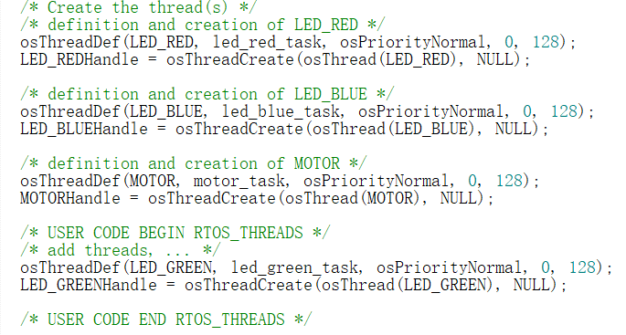
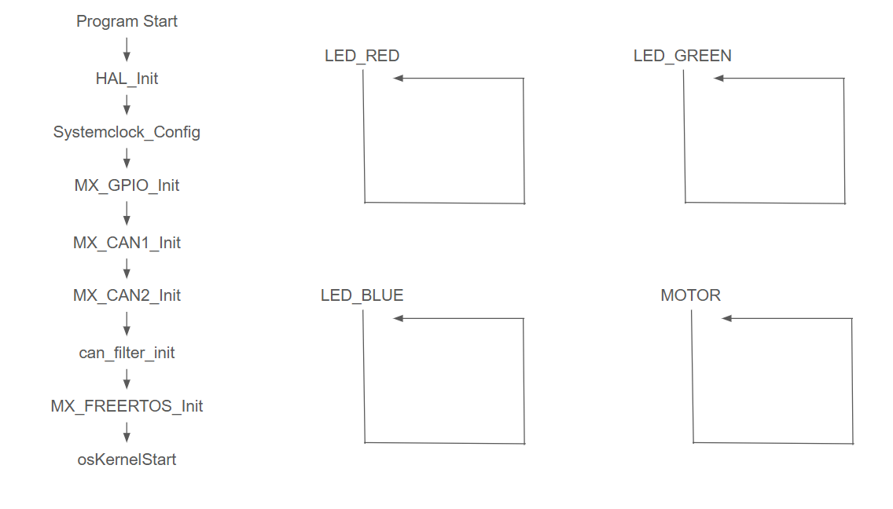

# FreeRTOS Control Motor
Demonstrate splitting tasks into FreeRTOS threads.

## Table of Contents
- [MultiThreading](#multithreading)
- [RTOS Characteristics](#rtos-characteristics)
- [Configuring FreeRTOS in CubeMX](#configuring-freertos-in-cubemx)
- [Creating Tasks in CubeMX](#creating-tasks-in-cubemx)
- [Creating Tasks in Code](#creating-tasks-in-code)

## MultiThreading
[Optional] If you are new to the idea of **multithreading**, search it up, and feel free to check out one of my repo explaning how multithread and multiprocess program are constructed: ()[].
In this chapter, you’ll use **FreeRTOS** to make LEDs blink independently, along with controlling the motor.  
By creating multiple tasks and assigning them to different threads, you’ll see the principles of **task scheduling** and **multitasking** in action.  
The goal is to help you understand how an operating system can manage multiple concurrent processes on the same microcontroller.

## RTOS Characteristics

- Task creation, scheduling, and management  
- Inter-task communication (message queues, semaphores)  
- Time management (delays, timeouts)  
- Memory and resource management  

FreeRTOS is widely used because it’s:
- Open source and portable  
- Small and fast  
- Easy to configure through STM32CubeMX  

To get you started, just remember two things:
1. FreeRTOS will always do **Round Robin** between tasks with highest priority.
2. FreeRTOS will only give time to lower priority tasks when all higher priority tasks are not able to run.

In this lesson, FreeRTOS will manage **three LED tasks** that blink at different rates.  

## Configuring FreeRTOS in CubeMX

1. Open your existing STM32F407 project in **STM32CubeMX**.  
2. Go to **Middleware -> FreeRTOS**, and enable it.  
3. Choose **CMSIS v1** as the API interface.  
4. Click **Config parameters** to open RTOS settings:
	- **USE_PREEMPTION**: Enabled
	- **Tick Rate_HZ**: 1000 (for 1 ms tick interval)
	- **MAX_PRIORITIES**: 7
	- **MINIMAL_STACK_SIZE**: 128 words
	- **MAX_TASK_NAME_LEN**: 16 chars

5. CubeMX automatically adds RTOS initialization code into:
	- `freertos.c`
	- `freertos.h`

6. Generate the project and open it in **Keil MDK-ARM**.

At this point, FreeRTOS initialization functions will be called in `main.c`, usually inside `MX_FREERTOS_Init()`.

## Creating Tasks in CubeMX

1. In **FreeRTOS Configuration**, open **Tasks and Queues**.  
2. Click **Add → New Task**, and name it `LED_RED`.  
3. Set:
	- **Task Name**: LED_RED
	- **Priority**: osPriorityHigh
	- **Stack Size**: 128
	- **Entry Function**: red_led_task
	- **Code Generate Option**: As external
	- **Parameter**: NULL
	- **Allocation**: Dynamic
4. Repeat the process for `LED_GREEN`, but set **Code Generate Option**: As weak.
5. Repeat the process for `LED_BLUE`, but set **Code Generate Option**: Default.

Note that since we are just creating a simple program where all tasks have the same priority, you can set **Priority** to different levels. Just make sure all tasks have the same priority.

CubeMX generates the following task stubs:

```c
extern void red_led_task(void const * argument);
_weak void green_led_task(void const * argument);
void blue_led_task(void const * argument);
```

Keyword `extern` means the actual implementation of the method is written somewhere else in your program, and can even be in a different language.
Keyword `_weak` means user can overwrite this method somewhere else, and program will use the new version over `_weak` version.
Method `blue_led_task` must be implemented in place.
Practice using `extern` and `_weak` by implementing those methods in main.c. For how to light LED, refer back to (01_led)[../01_led/01_led.md].

## Creating Tasks in Code
CubeMX just generate code for us, we can also conveniently create new tasks in the generated code, thanks to functions already provided.

Open `freertos.c`, and locate the part where trasks are created in `MX_FREERTOS_Init`. Under `/* USER CODE BEGIN RTOS_THREADS */`, you can create new tasks by first defining a new thread with `osThreadDef` and `osThreadCreate`.



Note that `osThreadDef` is not a variable, but rather a macro.
```C
#define osThreadDef(name, thread, priority, instances, stacksz) \ 
extern const osThreadDef_t os_thread_def_##name
```
- Name: osThreadDef
- Function: Configure the task to be created.
- Parameter 1: name — Name of the task to be created.
- Parameter 2: thread — Entry function name of the task code.
- Parameter 3: priority — Priority of the task to be created.
- Parameter 4: instances — Number of thread instances that can be created for this task.
- Parameter 5: stacksz — Stack size of the task.

`osThreadCreate`, a function provided by CMSIS, will take in such a macro to create a new thread.
```C
osThreadId osThreadCreate (const osThreadDef_t *thread_def, void *argument);
```
- Function Name: osThreadCreate
- Function Purpose: Create a task.
- Return Value: osThreadId — Task ID.
	- This is an important identifier; you need it to modify task priority, delete a task, etc.
	- Declare a variable of type osThreadId to store the return value.
- Parameter 1: const osThreadDef_t *thread_def — The task definition set up by osThreadDef.
	- Enter as osThread(<task_name>).
	- Example: if the task is defined as osThreadDef(LED_RED, ...), then use osThread(LED_RED) here.
- Parameter 2: void *argument — Initialization parameter needed by the task, usually NULL.

Create a thread for motor control in code, then write the thread function name you defined with `osThreadDef` with other thread functions. You can choose to implement the function where it is, or use `extern` or `_weak`. You can then copy your motor control code from last lesson into this function.

