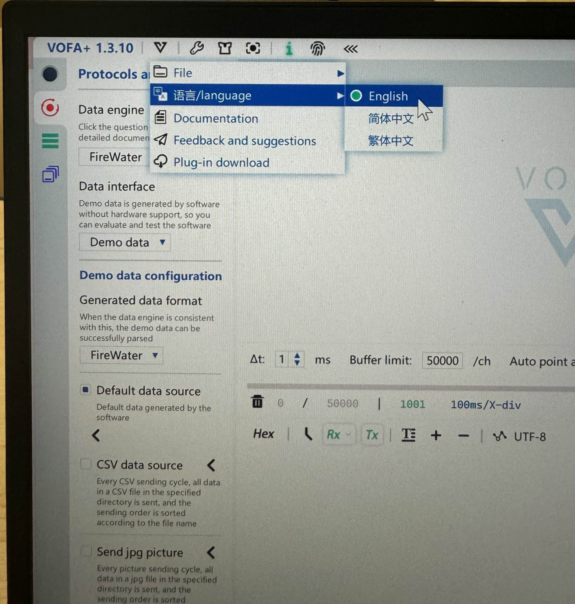
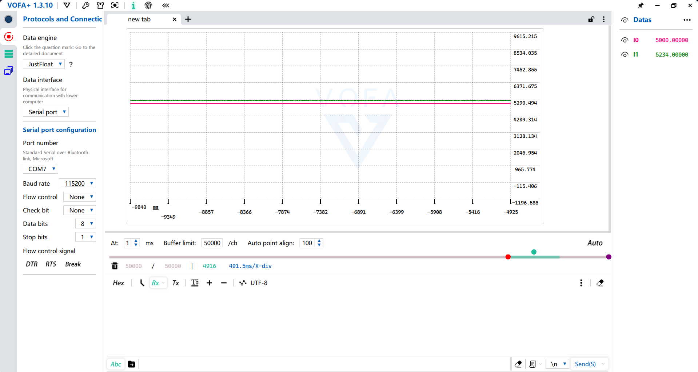

# UART Protocal and Vofa+
Introduction to UART communication protocol and using it for data monitoring in Vofa+

This tutorial is built upon the program you created in 02_signal_interrupt

## Table of Contents


## Setting up UART in CubeMX
Under **Connectivity** in **Pinout & Configuration** page, enable **USART1** with **Asynchronous** mode.

 - Mode
     - Mode: Asynchronous
	 - Hardware Flow Control: Disable
 - Parameter Settings
     - Baud Rate: 115200 Bits/s
	 - Word Length: 8 Bits
	 - Partiy: None
	 - Stop Bits: 1
	 - Data Direction: Receive and Transmit
	 Over Sampling: 16 Samples
 - NVIC Settings
     - USART1 global interrupt: Enabled
 - GPIO Settings:
     - PA9: USART1_TX
	 - PB7: USART1_RX

This is all you need to enable UART port. Refer to the Development Board C User Manual, you will find out that the USART1 port we just enabled is actually marked as **UART2** on the actual board. Remember that when you are connecting wires.

## Using UART in Keil
In the example project included in this lesson, copy over our version of the following files and add to your just-generated project:

 - CAN_receive.c/.h
 - struct_typedef.h
 - bsp_can.c/.h
 - volt.c/.h

In Keil, set your project directory to look like this:

 - Project: [project name]
     - [project name]
	     - Application/MDK-ARM
		     - [some files]
		 - Application/User/Core
		     - [some files]
		 - Drivers/STM32F4xx_HAL_Driver
		     - [some files]
		 - Drivers/CMSIS
		     - [some files]
		 - application
		     - CAN_receive.c
			 - CAN_receive.h
			 - struct_typedef.h
		 - bsp
		     - bsp_can.c
			 - bsp_can.h
		 - vofa
		     - volt.c
			 - volt.h

In the `main.c`, make sure to include `can_receive.h`, `bsp_can.h`, and `volt.h`.

## Use Vofa+ to Receive UART Messages
Download the application Vofa+, yes it is a Chinese website. You can later change the language to English as shown in the following image.



Take a look into `volt.h`, the `uint8_t Sent[DATA_LEN*4+4];` is the array that will store some numbers you want to receive through USART1 port, `DATA_LEN*4` indicates each data takes up 4 bytes, here the values will be casted into floats, the `+4` is dedicated for overhead information. Going from here, it is no hard to understand that by changing the value of `DATA_LEN` in this file to a natural number **n**, you can then receive information about **n** number of values.

Going back to `main.c`, let's try to track the live values of `target_angle` and `current_angle` by adding the following two lines to your while loop (make sure the variable are properly initialized before you try to track them).

```C
  /* USER CODE BEGIN WHILE */
	int16_t full_angle = 8191;
	int16_t target_angle = 5000;
	int16_t half_angle = full_angle / 2;
	const motor_measure_t *current_yaw_gimbal_motor_measure_ptr;
	int16_t current_angle;
	int16_t diff_angle;
	
	int16_t error;
	int16_t error2;
  while (1)
  {
    current_yaw_gimbal_motor_measure_ptr = get_yaw_gimbal_motor_measure_point();
		current_angle = motor_chassis[4].ecd;
		error = target_angle - current_angle;
		error = (error > 4096) ? (error - 8192) : (error < -4096 ? (error + 8192) : error);
		volt.Volt_Data.Data[0] = target_angle;
		volt.Volt_Data.Data[1] = current_angle;
		Volt_Sendware();
		CAN_cmd_gimbal(3*error,0,0,0);
		HAL_Delay(1);
    /* USER CODE END WHILE */

    /* USER CODE BEGIN 3 */
  }
```

Open up Vofa+, in **Protocols and Connections** page, set **Data Engine** to **JustFloat**, **Data interface** to **Serial port**, and **Port number** to which ever port on your device that is connected to the debugger.

In the Widgest page, bring a Oscillogram to your tab (you might need to right click to open a new tab).

After you click start (the top left blue circle button that will start flashing when it is tracking live data), you will notice the two values are being tracked in the right panel. Add these two values to be tracked by the Oscillogram.



Now, you have unlocked a powerful way to analyze live data to helpl you debug, optimize values, and improve code.